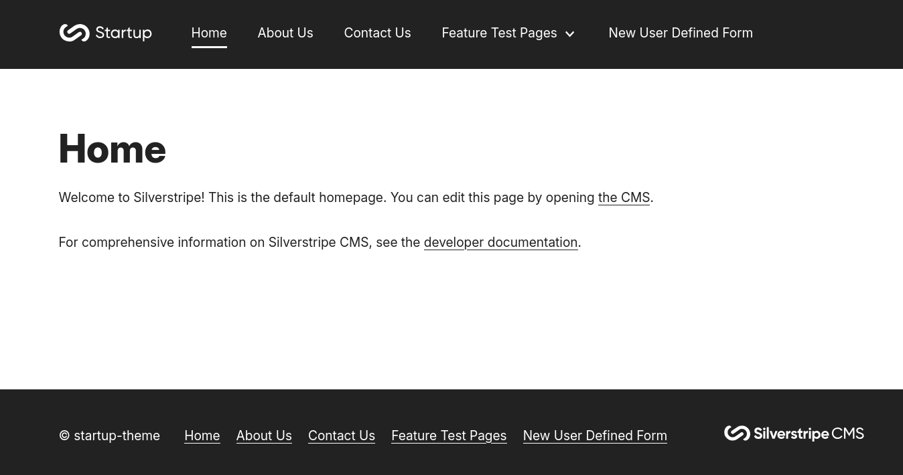

# startup-theme

The default theme for Silverstripe CMS.

Startup has been designed to be quickly customisable and extendable so that you
can spend minimal time on boilerplate code and more time building your application. Startup is also intended to be a
demonstrative tool for Silverstripe CMS beginners to get a feel for how the framework operates.

--------

## Relevant documentation

If you're new to Silverstripe CMS, the following documentation should help you understand how this theme is constructed and what the different parts (e.g. templates) do.

- [themes](https://docs.silverstripe.org/en/developer_guides/templates/themes/)
- [templates](https://docs.silverstripe.org/en/developer_guides/templates/)
- [template syntax](https://docs.silverstripe.org/en/developer_guides/templates/syntax/)
- [Requirements API](https://docs.silverstripe.org/en/developer_guides/templates/requirements/)
